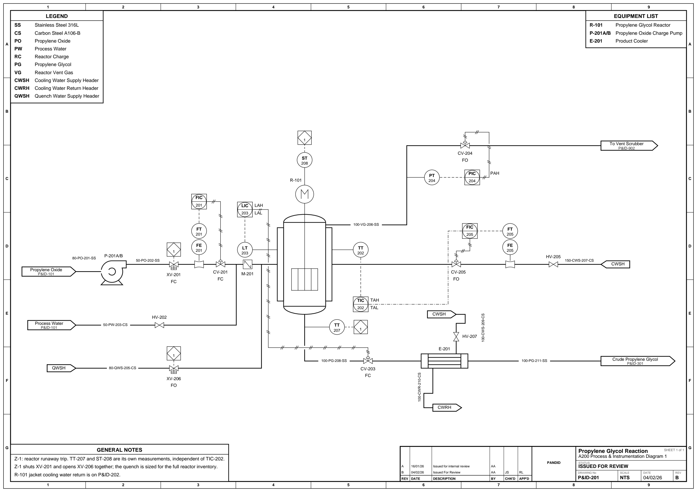

# Example gallery

Every script in [`examples/`](../../examples) rendered to SVG and PNG. The PNG is
shown inline (raster, 2400 px wide); the SVG beside each heading is the real
output: vector, searchable text, and what `fs.render("…svg")` actually writes.

These are **generated, not hand-drawn**. One command rebuilds all of them:

```bash
python scripts/gallery.py
```

`tests/test_gallery.py` checks every sheet here against the regression fixture
for the same drawing in `tests/golden/`, so a sheet left stale fails the suite
instead of sitting on `main` showing a drawing the package has stopped
producing.

The generator draws each sheet under its example's stem. Run an example yourself
and it writes its own name into `examples/` (gitignored) instead:
`03_distillation_train.py` writes `distillation_train.svg`.

---

## 01 · Ammonia loop

[`examples/01_ammonia_loop.py`](../../examples/01_ammonia_loop.py) ·
[SVG](01_ammonia_loop.svg)


Fully automatic: no coordinates anywhere. Seven units and their connections go
in, and the engine assigns layers, orders them, places them on a common flow
axis and routes every stream. The compressor discharge back to the mixer is
detected as the recycle and carried across the top of the sheet, and the streams
are numbered `S1`…`S7` in creation order.

## 02 · Manual layout, with the coordinate overlay

[`examples/02_manual_layout.py`](../../examples/02_manual_layout.py) ·
[SVG](02_manual_layout.svg)


The pixel-level escape hatches, drawn with `debug=True`. The red grid, the red
crosses on every `pin(x=, y=)` corner and the blue dots on every port are the
overlay, not the drawing; it is off by default. The two trains are the same
geometry said two ways — the top pinned by the corner, the bottom pinned by the
nozzle onto one elevation. The last run uses `via([...])` to force an explicit
detour the auto-router would never choose but honours verbatim.

## 03 · Distillation train

[`examples/03_distillation_train.py`](../../examples/03_distillation_train.py) ·
[SVG](03_distillation_train.svg)


The full engineering sheet: a full-width title strip with revision history,
client and project rows, issue status and scale, and `border="zone"` for the
zone-ruled frame around it. Furniture docks flush to that frame — an auto
`equipment_list()` built from each unit's `description`, numbered `notes()`, and
a `legend()` — and the stream property table runs along the foot with a "Mass
Fraction" section header injected via `stream_table_sections`. Two columns,
their overheads and bottoms pumps, a bottoms splitter, and a recycle through
FV-200 back to the feed mixer.

A second `fs.render()` with the same arguments and a `.drawio` name writes
[`drawio-samples/03_distillation_train.drawio`](../../drawio-samples/03_distillation_train.drawio).
It is the one sheet in the sample set that draws a stream table: 21 columns
exported as a real draw.io table rather than as a picture of one.

## 04 · Control loop

[`examples/04_control_loop.py`](../../examples/04_control_loop.py) ·
[SVG](04_control_loop.svg)


ISA-5.1 instrumentation. Two loops, each closing on a real final control
element: FIC-101 drives FV-101's actuator over a pneumatic line, LIC-101 drives
LV-101 over an electric one. FE-101 sits *on* the line (`offset=0`) with FT-101
above it on the same tap; LIC-101 mounts on the drum's south face with its
high/low alarms alongside on the same loop number and an interlock square hung
underneath on a dashed line. PSV-101 is an ordinary `Valve(variant="relief")`,
tagged as plain text beside the symbol rather than in a balloon.

## 05 · Reactor recycle

[`examples/05_reactor_recycle.py`](../../examples/05_reactor_recycle.py) ·
[SVG](05_reactor_recycle.svg)


Automatic again, and the clearest demonstration of the straightened spine: feed
→ mixer → compressor → cooler → separator → splitter all land on one horizontal
axis. The splitter purges one outlet to a product flag and recycles the other
back to the mixer; `draw_as_recycle=True` tells the cycle breaker which edge to
tear, and the recycle is routed clear across the top.

## 06 · Column reflux and reboiler

[`examples/06_column_reflux.py`](../../examples/06_column_reflux.py) ·
[SVG](06_column_reflux.svg)


A fractionation sheet drawn the way one actually is: tower on the left,
condenser high and right with the reflux drum beneath it, kettle reboiler off
the bottom. Both loops close on the column itself through its `reflux_in` and
`boilup_in` return nozzles rather than being faked as recycles to an upstream
unit, and the bottoms product leaves from the reboiler's own draw at the weir
end. The drum's inlet is authored on three faces and the engine takes the top
one, since the condenser drains straight down onto it, and the condenser is
`mirrored="x"` so it drains toward the drum. Equipment is pinned by nozzle
fraction, which is what makes every run either straight or a single corner.

## 07 · Metering skid

[`examples/07_metering_skid.py`](../../examples/07_metering_skid.py) ·
[SVG](07_metering_skid.svg)


The in-line fitting and actuated-valve families on one spine: a suction
`strainer`, pump, `rotameter`, a `motor`-operated throttle valve, a surge vessel
with a spring `psv` to flare, and a `sight_glass` on the way out. The valve is
`mirrored="y"` so its operator faces down toward the controller instead of
making the signal climb over the vessel, and LIC-101 takes its output on its
west face because that is the side the valve is on. The only rise on the sheet
is across the pump, whose discharge nozzle really is above its suction.

## 08 · Built from data

[`examples/08_from_data.py`](../../examples/08_from_data.py) ·
[SVG](08_from_data.svg)


The only example that writes no flowsheet code at all: one plain mapping, the
kind you would keep in a YAML file beside the equipment list it came from,
handed to `Flowsheet.from_dict`. Layout, routing and stream numbering run
exactly as they do for the hand-written sheets, and `to_dict()` writes the same
spec back out.

The process is a boiler feedwater package, and it carries a complete ISA-5.1
level loop: `LT-201` on the deaerator measures, `LIC-201` in the control room
decides, and `LY-201` on the valve acts. An electric signal goes into the
controller, an electric signal comes out of it, and a pneumatic line strokes the
actuator. `M-201` is a three-inlet header.

## 09 · Line numbers

[`examples/09_line_numbers.py`](../../examples/09_line_numbers.py) ·
[SVG](09_line_numbers.svg)


Every line is labelled the way the line list has it, `8"-P-1001-A1A` for size,
service, sequence and spec, instead of `S1`. The components go in on
`connect()`; the sequence is filled by the same numbering that hands out stream
numbers, so nothing has to be kept unique by hand. The suction line keeps one
number through HV-101 and ST-101, and breaks at the two units marked
`new_line_number`: the spec changes A1A → D1B across FV-101 and the size changes
3" → 4" across PSV-101. The tail-pipe to flare takes its `sequence` by hand, for
a line that already exists on someone else's list. The stream table underneath
is headed by the same line numbers. The sheet is drawn as a P&ID
(`diagram="p&id"`), so its process lines carry no arrowheads.

## 10 · Ethanol purification PFD

[`examples/10_ethanol_pfd.py`](../../examples/10_ethanol_pfd.py) ·
[SVG](10_ethanol_pfd.svg)


A whole issue-ready sheet, and the one example drawn on a **real A3 page**:
`page_size="A3"` fixes the sheet at 420 × 297 mm, so the SVG declares that
physical size, the zone grid belongs to the page rather than to the drawing, and
the scale cell reports the ratio the drawing was actually placed at. The
furniture rules to the page edges and the drawing is fitted into what is left.

Six off-page connectors carry the drawing they tie into, the equipment list is
named row by row with `include=`, a `TableBox` carries the utilities summary
above the title strip, and the stream table along the foot is sectioned into a
"Mass Fraction" block. Both places the piping parts are `Tee`s, drawn as nothing
at all and tagged nowhere: the reflux one carries its number straight through,
and the press one sets `new_line_number` and breaks it. Where a run is left
unnumbered, its segments share the number of the stream they serve, so each is
drawn once and heads one table column.

## 11 · Ethanol purification P&ID

[`examples/11_ethanol_pid.py`](../../examples/11_ethanol_pid.py) ·
[SVG](11_ethanol_pid.svg)


The P&ID counterpart of `10`: the same unit on the same `page_size="A3"` sheet,
drawn as the piping and instrumentation diagram (`diagram="p&id"`, so no process
line carries an arrowhead). Every line is identified by its line number, and one
number runs through the hand valves, the reducers and the control valve of a
station because a station is one line.

The overhead, reflux, distillate and steam control valves are each one
`add_valve_station()` call: isolation valve, drain tee, reduction, control
valve, expansion, drain tee, isolation valve, with a bypass over the top on its
own `normal_position="closed"` valve. The cooling-water and steam tie-ins are
`header=True` flags, so both supplies read `CWSH` and both returns `CWRH`. Five
loops close on a final control element, including `TT-302 → TIC-302 → FIC-303`
cascading the tower-top temperature onto the reflux flow controller, and the
`sis` interlock square is drawn at all four places the trip acts. `via()` pins
the routes of the lines that carry balloons, since an attached instrument hangs
off the *routed* path and would move with a line the router was free to re-bend.

It also shows the **draw.io export**: a second `fs.render()` on the same
flowsheet with the same arguments and a `.drawio` name writes
[`drawio-samples/11_ethanol_pid.drawio`](../../drawio-samples/11_ethanol_pid.drawio).

## 12 · Block flow diagram

[`examples/12_block_flow_diagram.py`](../../examples/12_block_flow_diagram.py) ·
[SVG](12_block_flow_diagram.svg)


The drawing a level above the PFD: one labelled box per plant section, the
streams between them numbered, and nothing inside them drawn. `units.Block` is
the only symbol on the sheet, and it is the one that connects on all four sides
— `inputs=["W", "N", "N"]` puts air and steam into the reformer from *above*
while the gas comes in from the left, the CO2 leaves the top of the removal
section, and the refrigeration section sends its recycle out of the *bottom*. A
plain count is the shorthand for the usual case: `inputs=1` is one connection on
the west.

Nothing here carries a `width` or a `height`; each box is as wide as its own
name and as tall as the connections on its walls need, which is why
`Shift & CO2 Removal` comes out wider than `Reforming`. It is pinned because the
layout engine ranks by process flow order and does not yet read a north-face
connection as wanting its source above it.

## 13 · Mineral concentrate dewatering

[`examples/13_mineral_dewatering.py`](../../examples/13_mineral_dewatering.py) ·
[SVG](13_mineral_dewatering.svg)


The first sheet here that is not a fluids plant. A flotation concentrate is
thickened in `TH-401`, dewatered on the vacuum belt filter `FL-401`, dropped as
cake onto `CV-401`, dried in the direct-fired rotary drum `DR-401`, recovered
out of its own drying gas by the cyclone `CY-401` and cleaned of tramp steel by
the magnet `MS-401`; the spent gas is scrubbed in `SC-401` and pulled to the
stack `VE-401` by the induced-draught fan `BL-401`. It brings thirteen
`(kind, variant)` symbols into the gallery that were registered and never drawn.

It is a **PFD**: an equipment list, a sectioned stream table, a utilities
summary, and not one instrument balloon. Four of its five junctions are
`Tee(branch="inlet")`s where a second stream *joins* a run, which is the reverse
of the takeoff tees `10` draws and the only place in the gallery either is
shown. It takes no `page_size` at all: twenty-four streams side by side is wider
than A3 carries beside a utilities summary, so the sheet is sized to its
drawing.

## 14 · Tank farm and road loading

[`examples/14_tank_farm.py`](../../examples/14_tank_farm.py) ·
[SVG](14_tank_farm.svg)


A bulk liquid storage terminal: three storage vessels, the transfer system that
draws them down, the rack that loads road tankers off it and the vapour system
that takes back what the loading displaces. Nothing on it is heated, cooled or
reacted, so it is the sheet that draws containment and line hardware — two
strainer bodies, a spectacle blind, a compensator, both reducer bodies, two
flame arrestors and a conservation vent, the families the reactor-and-column
examples never reach for.

Every loop number here is *allocated*: `add_loop("L")` is written without a
number and the sheet counts out L-601, L-602, P-603, F-604, F-605 in declaration
order, which no other sheet in the gallery demonstrates.

## 15 · Condensing turbine and vacuum system

[`examples/15_condensing_turbine.py`](../../examples/15_condensing_turbine.py) ·
[SVG](15_condensing_turbine.svg)


The first instrumented sheet the engine lays out on its own: two loops, a
shared-display controller, an auxiliary-location gauge board and an interlock
diamond, and not one `pin()`. Every balloon states only which face of its host
it hangs off and how far out; where the equipment under it goes, and where the
signal lines run, is the engine's answer.

HP steam is dried in `S-701`, expands through `ST-701` and condenses in the
air-cooled `E-701` into the receiver `V-701`, which the steam-jet ejector
`EJ-701` holds under vacuum. It brings eleven `(kind, variant)` symbols into the
gallery that were registered and never drawn, including the turbine, the ejector
and the heater — the three equipment kinds that had never appeared at all.

## 16 · Demineralised water plant

[`examples/16_demineralised_water.py`](../../examples/16_demineralised_water.py) ·
[SVG](16_demineralised_water.svg)


The other auto-laid-out sheet, and the one that shows a title strip and an
`equipment_list()` docked onto a drawing nobody placed. Raw water runs through a
multimedia filter, an activated carbon bed and a cation exchanger; the packed
degasser `D-801` is stripped with blower air before the anion exchanger and the
mixed bed.

Its shape is the engine's, not an author's: `B-801` sits under the tower it
serves rather than beside the raw water tank, because ranking pulls a branch up
against the spine it joins instead of leaving it at the sheet's left edge. Eight
more previously-undrawn symbols — the packed column, three filter bodies, both
tank ends, the duplex strainer and the handwheel globe valve.

## 17 · Stirred reactor train

[`examples/17_stirred_reactor_train.py`](../../examples/17_stirred_reactor_train.py) ·
[SVG](17_stirred_reactor_train.svg)



The composition layer drawn as plant. `R-101` is
`Reactor(variant="jacketed", agitator="turbine")` — a dished-end shell, ISO item
28.4's stirrer inside it and item 20.6's drive motor on the shaft above, none of
which is a symbol of its own. Propylene oxide and process water are metered,
mixed and charged; the hydrolysis is exothermic, so the reactor temperature sets
the jacket cooling-water flow through a cascade, and a runaway trip shuts the
feed and opens the quench on two measurements of its own.

The fourth A3 sheet and the densest instrumented one after 11: five loops, an
alarm pair lettered in three balloons' own quadrants, and one interlock square
drawn at each of the four places it acts.

## 18 · Fixed-bed reactor with recycle

[`examples/18_fixed_bed_recycle.py`](../../examples/18_fixed_bed_recycle.py) ·
[SVG](18_fixed_bed_recycle.svg)


A methanol synthesis loop: make-up gas compressed in, heated against the
converter effluent, fired to reaction temperature, reacted over the packed bed
`R-301`, separated, and the unreacted remainder sent round again behind a purge
that holds the loop pressure.

`Reactor(internals="packing")` is ISO item 27.8's crossed bed in the same shell
example 17's reactor and example 20's molecular sieve are drawn from — and
naming `internals=` is what leaves the default agitator out, so no stirrer is
drawn through the catalyst. Nothing is pinned: the engine tears the recycle,
lays the loop out as a forward train and draws the return as a lane across the
foot of the sheet.

## 19 · Absorber and stripper

[`examples/19_absorber_stripper.py`](../../examples/19_absorber_stripper.py) ·
[SVG](19_absorber_stripper.svg)


Two columns on one PFD, and they are not the same tower, nor the same class.
`T-401` is an `Absorber`: sour gas contacts lean MDEA at 66 bara on
`internals="valve_tray"`, and nothing in it boils, so it has no reboiler,
condenser or reflux loop, and its two counter-current feeds are placed with
`feed_stages=` like any other column's. `T-402` strips the acid gas back off
just above atmospheric on `internals="packing"`, where pressure drop is the
design because every millibar across the tower raises the reboiler's bubble
point -- but it keeps its own overhead condenser and reflux drum, so it stays
a plain `Column` rather than a `Stripper`. ISO gives an absorber and a
regenerator no symbols of their own, so what tells the two drawings apart is
what is drawn inside them; what tells the two *classes* apart is the nozzles
each one has.

Twenty streams in a sectioned table, a lean/rich cross exchanger, a kettle
reboiler, and the one control valve a PFD earns: the 64-bar break between the
two towers.

## 20 · Molecular sieve dryer

[`examples/20_molecular_sieve_dryer.py`](../../examples/20_molecular_sieve_dryer.py) ·
[SVG](20_molecular_sieve_dryer.svg)


Two beds, one on line and one regenerating, and eight switching valves that swap
them. `V-501A` and `V-501B` are the *same call* twice over —
`Column(internals="packing", trays=1)` — and the same drawing as example 18's
catalytic converter: a packed bed, an adsorber and a molecular sieve are one
mark in ISO 10628-2, told apart by the tag beside it.

Wet gas runs down through the on-line bed and hot regeneration gas up through
the other, which is what puts the driest gas last against the end the next cycle
has to hold on specification. `KY-501` is one logic function drawn at each of
the eight valves it strokes, and the only repeated square in the gallery that is
not a trip.

## 21 · Alumina refinery

[`examples/21_alumina_refinery.py`](../../examples/21_alumina_refinery.py) ·
[SVG](21_alumina_refinery.svg)


The Bayer process end to end, and the largest sheet here: twenty-eight tagged
items and fifty-six streams, sized to its own drawing because a table that wide
fits on no standard page. Bauxite is crushed in `CR-901` and ground in spent
liquor in `ML-901`; the slurry is preheated against two stages of flash vapour,
held in the desilication tank `TK-901`, pumped up and taken to 145 °C with live
steam in `E-903`, and digested in `D-901`. The blow-off flashes through `V-901`
and `V-902`, and each flash serves the interchanger its own temperature suits —
the hotter one nearer the digester — so the two vapour lanes cross, which is
what counter-current interchange looks like drawn.

Red mud settles in `TH-901` and is washed in `TH-902`; the green liquor is
polished in the press `F-901`, cooled, seeded and precipitated in `PR-901` and
`PR-902`; `CY-901` and `CY-902` classify the product hydrate from the seed;
`F-902` washes it and `CA-901` calcines it. **The circuit closes**: spent liquor
leaves classification, is concentrated in `EV-901` and returns to the mill on
`S-903`, which runs the border of the sheet rather than across it. The stream
table is a real balance — 212 t/h of bauxite makes 100 t/h of alumina, and the
caustic and dissolved alumina come back to the values they left with.

Its symbols are the minerals and solids families the fluids sheets never reach
for: a jaw crusher and a ball mill, two gravity separating vessels (ISO 8.3
X8031 — a thickener is that symbol, and the rake is a mechanical internal the
standard does not draw), three hydrocyclones, a fluidised-bed calciner, and two
cake-forming filters that pipe `wash_in` and `cake` as well as the filtrate.
