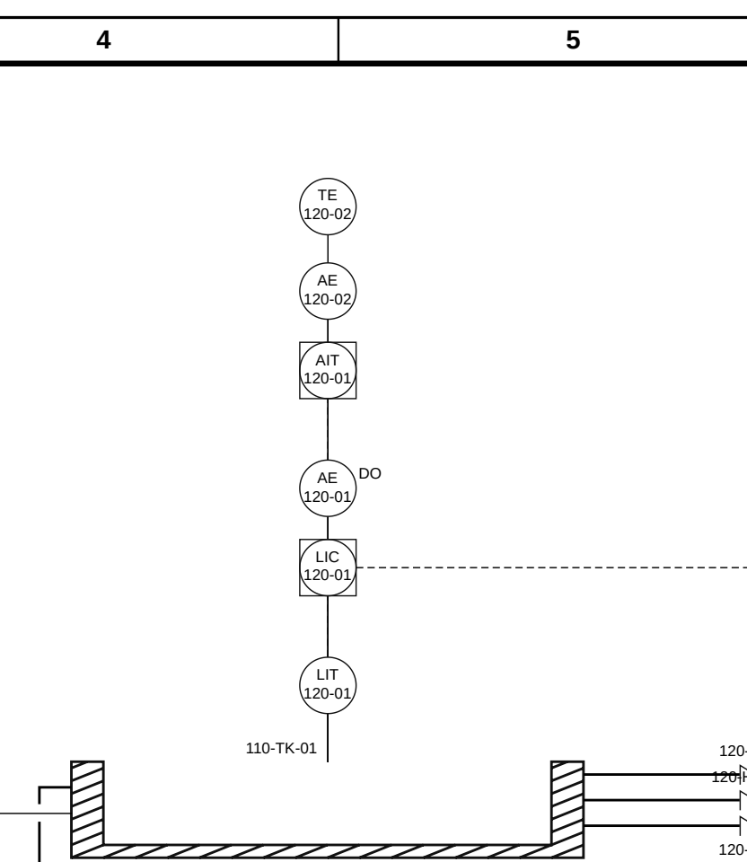
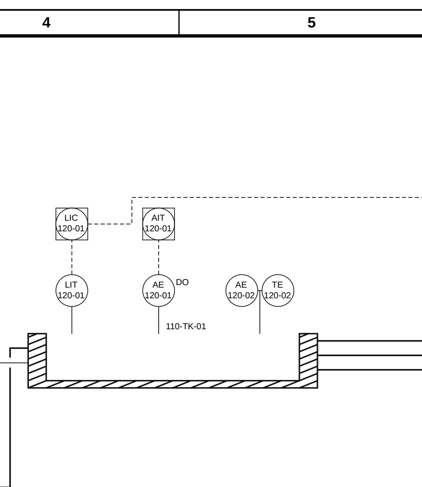

# Instrument process connections — 2026-09-11

Implemented on `puranos/instrument-tapping-20260911`, from
`a5e17ffd618112d727f8507d183efbbadd709de1`.

The previous `shared_tap_stacks` grouped instruments by host identity, tap,
offset and angle. Its comment called that a declaration, but none of those
fields states that two readings come from one physical insertion. The layout
then assigned increasing distances on a common stem, and the halo reserved
that cumulative depth. A second independent instrument could therefore appear
to be another function of the first. `face_point` compounded the problem by
always returning the face midpoint: upstream data could not locate two
independent taps across one face.

A stem now represents a process connection. `shared_tap_stacks` reads only
explicit host declarations and returns horizontal row placements. It reserves
the whole row, moves the row together when it needs clearance, and emits one
common stem with horizontal branches to its channels. Each independent field
instrument retains its own attachment. A panel function remains a child of its
own field device. The existing angular search and actuator relations are
preserved.

`Instrument.attach` and `Flowsheet.add_instrument` accept `along`, a finite
numeric fraction from 0 to 1. On N/S it runs left to right; on E/W it runs top
to bottom across the drawn box after the host's transformation. Omitted or
`None` selects 0.5; the centre uses the original arithmetic. A stream refuses
`along`, because its `at` fraction already locates the tap along the routed
path. The parameter also passes through primary-balloon and control-loop
helpers, specs and `profiles.templates.from_template`.

```python
lit = fs.add_instrument('LIT', '101-07', sensing=basin, at='N', along=.2)
ae = fs.add_instrument('AE', '101-08', sensing=basin, at='N', along=.8)
lic = fs.add_instrument('LIC', lit.number, sensing=lit, at='N', display='central')
ait = fs.add_instrument('AIT', ae.number, sensing=ae, at='N', display='central')

ph = fs.add_instrument('AE', 201, sensing=basin, at='S', offset=60)
temperature = fs.add_instrument('TE', 201, sensing=basin, at='S', offset=60)
basin.declare_multi_channel(ph, temperature)
```

The same declaration method works on a process stream. Members must be
separate field sensing instruments on the same sheet, attached to the same
host and tap with equal offsets and perpendicular angles, without absolute
pins. Declarations are rechecked after edits and serialized as
`multi_channel_elements` records containing `host` and `members`. Template
host rows use `multi_channel_elements: [["channel-key-a", "channel-key-b"]]`;
instrument attachment rows carry `along`. No declaration is inferred from a
coordinate, loop number or tag.

Undeclared coincident process taps are an `instrument-tap-undeclared` error.
The model check catches matching attachment coordinates; the geometry check
also catches different faces meeting at the same corner. Offsets, angles and
pins do not exempt an independent connection. A stale declaration is
`multi-channel-invalid`. `layout()` and `route()` remain geometry operations;
`validate()` reports these errors and checked SVG/draw.io exports refuse them.
Malformed `along` values are rejected before changing the attachment or adding
the instrument. The pre-existing explicit `check=False` diagnostic export
option is unchanged.

The common stem and channel branches also need separate native identities.
The stem now receives the first channel's stable ID plus `-tap-stem`, while
channel connections retain their existing `-tap` IDs. The native specimen
caught and tests now prevent the initial duplicate-ID failure from reusing
the first channel's connection identity for both segments.

## Rendered comparison

The [before PDF](instrument-tapping-evidence-20260911/before.pdf) and
[after PDF](instrument-tapping-evidence-20260911/after.pdf) contain 28 units and
25 connections, including three transfer trains, their isolation and control
valves, an equalisation basin, air supply, multiple influent/return boundaries,
independent field/panel pairs, a multi-channel insertion, nameplates and the
native title strip. They use A1, drawing scale 0.44 and print scale 2.7.
These are synthetic engineering review specimens extended from the saved
Equalisation template, not altered project records.

The same [input](instrument-tapping-evidence-20260911/input.json) was rendered
through an archive of `a5e17ff` and the corrected engine. Both use a 400-unit
basin and minimum column gaps (`fill_columns=false`). An initial arrangement
with automatic column filling exceeded the A1 capacity after the row grew;
the final comparison changes the arrangement identically in both versions,
without shrinking lettering or changing capacity checks.

| Measured property | Before | After |
| --- | ---: | ---: |
| Units / connections | 28 / 25 | 28 / 25 |
| Independent LIT/AE tap pitch | 0 | 120 |
| LIT stem offset normal to the north face | 60 | 60 |
| Independent AE stem offset normal to the north face | 214 | 60 |
| Independent stem horizontal deviation | 0 / 0 | 0 / 0 |
| Declared AE/TE channel horizontal pitch | 0 | 50 |
| Declared AE/TE channel vertical separation | 66 | 0 |
| Routing converges | yes | yes |
| Existing native IDs removed | — | 0 |
| Existing native `fontSize` values changed | — | 0 |

Distances are engine drawing units. The independent panel functions remain
above their own field devices. The declared pair has two 44-unit bubbles with
6 units of clear paper between them and one common process stem. The full
pages were reviewed along with these equal-scale PDF crops:

| Before | After |
| --- | --- |
|  |  |

Editable masters are [before.drawio](instrument-tapping-evidence-20260911/before.drawio)
and [after.drawio](instrument-tapping-evidence-20260911/after.drawio). Engine
SVGs, measured coordinates, source hashes and file hashes accompany them in
the [manifest](instrument-tapping-evidence-20260911/manifest.json).
Draw.io Desktop 31.4.4 exported both PDFs headlessly, without XML patches.
The PDFs contain equal non-whitespace character multisets; one line caption
changes orientation, so whitespace token counts differ. This verifies retained
content and print size, not a new symbol qualification.

The supplied `nanded-r6.pdf` pages 5 and 10 were inspected locally. Page 5's
LIT 101-07 and AE 101-08 show independent field/panel columns; page 10's
PI/PIT and FIC/FIT show functions within their respective loops. The
multi-channel side-by-side rule is the owner's stated ruling. The PDF hash
and inspected page numbers are in the manifest; the reference itself is not
redistributed.

The specimen retains two unrelated routing warnings in both versions: a
short slanted isolation-to-pump segment and a detour in the second train.
They are recorded in both measurement files. They do not occur on the
instrument stems, and this task does not change those process routes.

## Rotation and verification

Distinct taps with adequate separation need no angular fallback. The tests
measure perpendicular stems on all four faces, and the dense specimen keeps
both independent stems at their requested 60-unit offset. Distinct but very
close taps can still rotate: at `along=.48` and `.52` on a 240-unit face,
9.6 units separate the taps while each bubble is 44 units wide. Their requested
positions overlap, and the existing search tries nearby angles before growing
the offset. A regression test measures that remaining behaviour; no angle
priority was forced to obtain the parallel-stem result.

The focused run reports **70 passed, exit 0** in
[focused-tests.txt](instrument-tapping-evidence-20260911/focused-tests.txt).
The tapping and sheet-fill tests cover independent taps, horizontal
shared rows, field/panel children, all face transformations, default and
endpoint fractions, invalid input, coincident corners, undeclared third
devices, stale declarations, stable native identities, template pass-through,
spec round trips, horizontal row reach on vertical process lines, and unchanged
angled actuator leaders. The prior
parameterized vertical-stack test and valve sensing test explicitly encoded
the superseded premise; they now require a host declaration and assert the
correct horizontal geometry, full halo, convergence and retained actuator
behaviour. No test was skipped, weakened or removed to hide a regression, and
no golden or gallery fixture was regenerated.

The final full suite reports **38 failed, 17,293 passed, 726 skipped, 0 errors,
exit 1**. The 38 failing node IDs are exactly the supplied baseline set:
**final minus baseline = empty; baseline minus final = empty**. There are 64
more passing cases than at the baseline. The complete [full-suite log](instrument-tapping-evidence-20260911/full-suite.txt)
is retained with the evidence.

The full-suite comparison is recorded in
[suite-delta.json](instrument-tapping-evidence-20260911/suite-delta.json).
It reads the supplied 38-entry baseline from
`/tmp/pandid-sheet-fill-full-suite.txt`, whose SHA-256 is
`c34ed1856593aef019b41526c6b58985751901900aaf33c74b4af5aeaeda4013`.
The baseline was not rerun, and `/tmp/pandid-baseline-b720dbb` was not changed.
Both node sets strip `FAILED`/`ERROR` and retain complete parameter IDs; changing
an outcome prefix does not create a new failure.

To reproduce the corrected native master:

```bash
PYTHONPATH="$PWD" python3 scripts/render_tapping_evidence.py \
  --input docs/instrument-tapping-evidence-20260911/input.json \
  --out /tmp/tapping-review --label after
```

For the before render, select a separate `git archive a5e17ff` extraction as
`PYTHONPATH`, and run the same script and input with `--label before`. The
parent ignores the new input fields, reproducing the old behaviour. Only the
corrected engine interprets the explicit host membership and face fractions.
